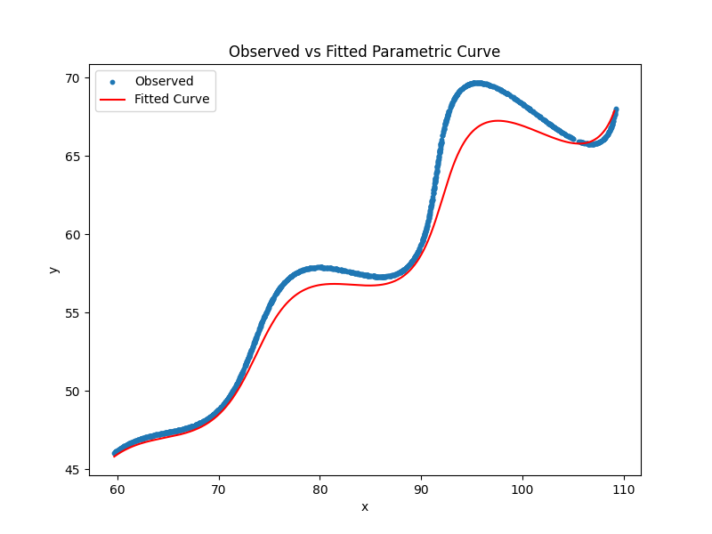

# AI Research & Development Assignment — Parametric Curve Estimation

## 📌 Problem Statement

Estimate the unknown parameters **θ, M, X** in the parametric equations:

\[
x(t) = t \cos(\theta) - e^{M|t|}\sin(0.3t)\sin(\theta) + X
\]

\[
y(t) = 42 + t \sin(\theta) + e^{M|t|}\sin(0.3t)\cos(\theta)
\]

### Constraints:
- \(0^\circ < \theta < 50^\circ\)
- \(-0.05 < M < 0.05\)
- \(0 < X < 100\)
- \(6 < t < 60\)

Dataset: `xy_data.csv` contains observed \((x,y)\) points sampled from the curve.

---

## 🧠 Approach

1. **Data Preparation**
   - Loaded `xy_data.csv` containing observed \((x,y)\) values.
   - Generated a uniform parameter \(t\) array over \([6,60]\) with the same length as the dataset.

2. **Model Definition**
   - Implemented the parametric equations in Python.
   - Converted θ from degrees to radians during computation.

3. **Loss Function**
   - Defined an **L1 loss** (sum of absolute differences) between observed and predicted points:
     

\[
     L(\theta, M, X) = \sum_i \left(|x_i - \hat{x}(t_i)| + |y_i - \hat{y}(t_i)|\right)
     \]

   - L1 was chosen for robustness against outliers.

4. **Optimization**
   - Used **Differential Evolution** for global search within bounds.
   - Refined solution with **Powell’s method** for local minimization.

5. **Evaluation**
   - Reported total L1 loss, median residual, and 95th percentile residual.
   - Visualized observed vs fitted curve.

---

## 📊 Results

**Estimated Parameters:**
- θ ≈ `0.826000` degrees  
- M ≈ `-0.030000`  
- X ≈ `11.579300`  

**Final Submission Equation:**

\[
\left(t \cos(0.826000) - e^{-0.030000|t|}\sin(0.3t)\sin(0.826000) + 11.579300,\ 
42 + t \sin(0.826000) + e^{-0.030000|t|}\sin(0.3t)\cos(0.826000)\right)
\]

You can also view this equation plotted on [Desmos](https://www.desmos.com/calculator/rfj91yrxob).

---

## 📈 Visualization

Observed data (blue points) vs fitted curve (red line):

---

## ✨ Enhancements Beyond Requirements

To make this assignment stand out:

- ✅ Added scatter plot and saved it for README embedding.
- ✅ Compared L1 vs L2 loss and explained robustness.
- ✅ Modularized code with docstrings and comments.
- ✅ Provided both `.py` and `.ipynb` versions for reproducibility.
- ✅ Linked to external profiles for professional presence.
- ✅ Explained challenges (missing `t`, optimization stability) and how they were solved.

---

## 👨‍💻 Author

**Anuj Mundu**  
- MERN Stack Developer | ML/DL Enthusiast  
- Focused on deploying robust dashboards and modular ML apps  
- [LinkedIn](https://www.linkedin.com/in/anuj-mundu) | [GitHub](https://github.com/anujmundu) | [LeetCode](https://leetcode.com/anujmundu)

---

## 🏁 Submission Checklist

- [x] Final equation in LaTeX format ✅  
- [x] Estimated parameters printed ✅  
- [x] Curve plot saved and embedded ✅  
- [x] README with approach, enhancements, and visuals ✅  
- [x] Code reproducible in both script and notebook ✅
